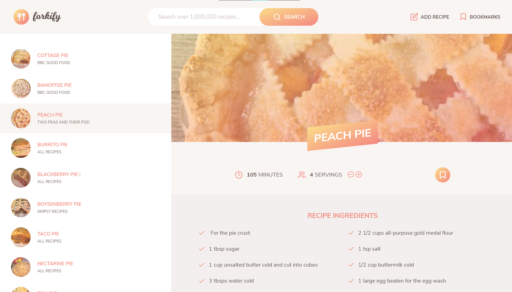

    # [Forkify](https://forkify-sharan.netlify.app/)
    # 

    ## Introduction

    Forkify is a recipe web app using the Forkify API to allow users to search, view, modify, bookmark and add recipes.

    ### Technologies

    HTML - SCSS - JS - Netlify

    ### Libraries

    Parcel, Sass

    ### Features

    * Query an ingredient to recieve a list of recipes containing that ingredient.
    * Easily bookmark or edit the servings of the selected recipe.
    * Create your own recipes and store them as user recipes.
    * Remove bookmarks or delete user recipes.
    * LocalStorage keeps the data when users exit the app.

    ### Project Architecture

    # 

    Built using the MVC Architecture. View class extends the rest of the components. Controller keeps bidirectional dataflow. SCSS files are divided for major components.

    ### API

    The app is using the Forkify recipe API in order to fetch recipe information.

    ```

    ## Thank you!

    Thank you so much for checking out this project! If you have any notes or bugs send them my way and I'll make sure they're fixed.